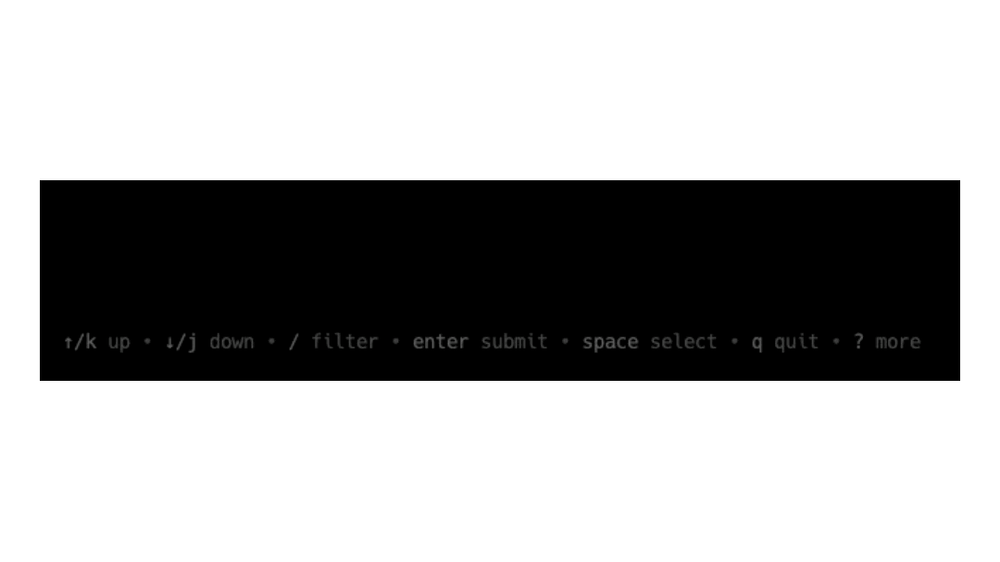

<div align="center">
<h1>️  pwgo  </h1>
<h5 align="center">
Multi-list cli tool to run your Playwright suite.
</h5>
</div>
<br>
<div align="center">
  
</div>

## Features

- 📓 New interactive selectable list view of available files, tests, and tags
- ⏳ Filterable list search
- 🔦 Tags, test and project total descriptive helpers


#### Table of Contents

- [Installation](#installation)
- [Command line arguments](#command-line-arguments)
  - [Help mode](#help-mode)

---

## Installation

### Homebrew

```console
brew tap dennisbergevin/tools
brew install pwgo
```

### Go

Install with Go:

```console
go install github.com/dennisbergevin/pwgo@latest
```

Or grab a binary from [the latest release](https://github.com/dennisbergevin/pwgo/releases/latest).

---

## Command line arguments

### Help mode

All available commands are included in the help menu:

```bash
pwgo --help
```

### Keyboard controls

> [!NOTE]  
> All keyboard controls are displayed on the bottom of the program. Additional commands can be seen by pressing the '?' key.



|                    Keys                     |                Action                 |
| :-----------------------------------------: | :-----------------------------------: |
|               <kbd>Up/k</kbd>               |    Move to selection above current    |
|              <kbd>Down/j</kbd>              |    Move to selection below current    |
|           <kbd>Right/l/pgdn</kbd>           |   Move to next page on current list   |
|           <kbd>Left/h/pgdn</kbd>            | Move to previous page on current list |
|              <kbd>g/home</kbd>              |      Go to start of current list      |
|              <kbd>G/end</kbd>               |       Go to end of current list       |
|              <kbd>Space</kbd>               |            Select current             |
|    <kbd>Shift</kbd> + <kbd>Right/l</kbd>    |          Toggle to next list          |
|    <kbd>Shift</kbd> + <kbd>Left/h</kbd>     |        Toggle to previous list        |
|                <kbd>/</kbd>                 |          Open Filter search           |
|              <kbd>Enter</kbd>               |        Submit/Run selection(s)        |
| <kbd>Ctrl</kbd> + <kbd>c</kbd>/<kbd>q</kbd> |                 Quit                  |
|                <kbd>?</kbd>                 |         Open/Close help menu          |
